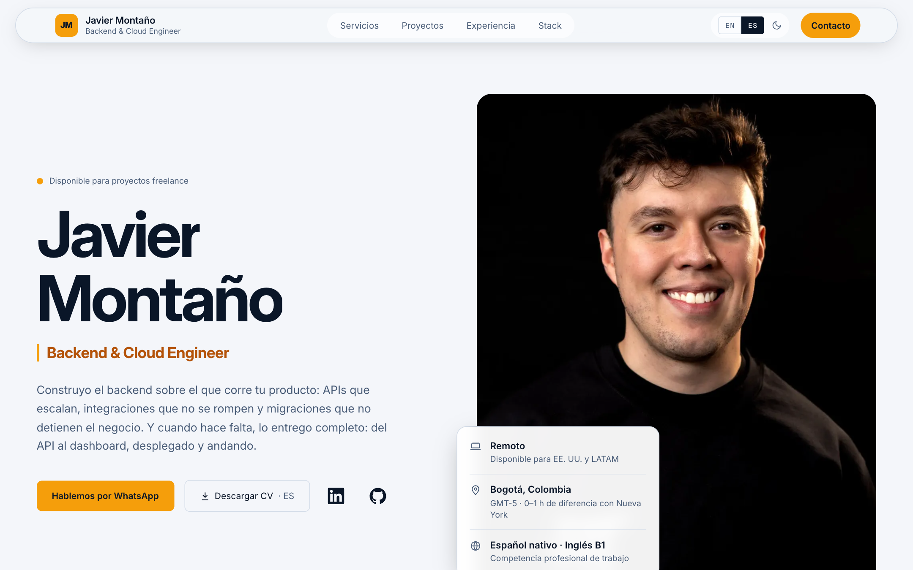
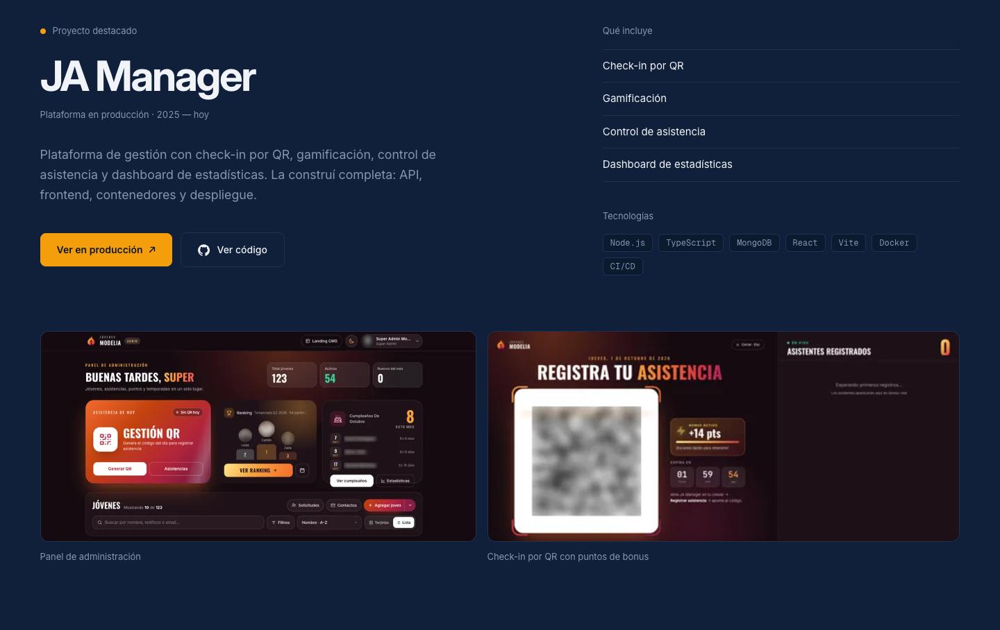
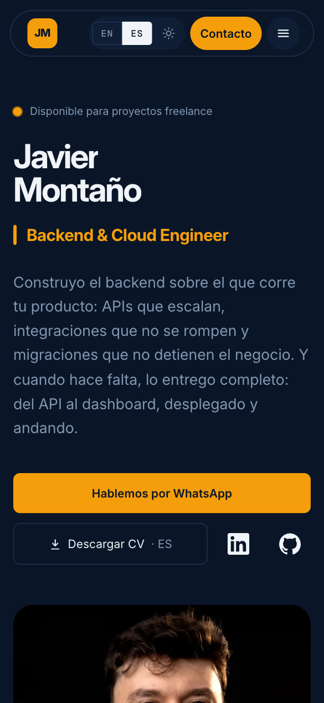
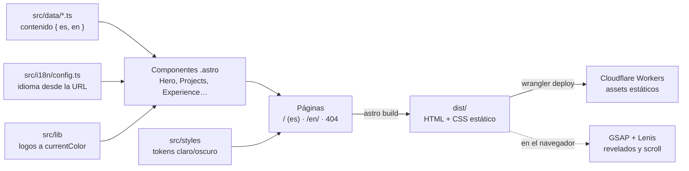

# Javier Montaño — Portafolio

Sitio personal de **Javier Montaño**, Backend & Cloud Engineer (Bogotá, Colombia).
Presenta servicios, proyectos, experiencia y formas de contacto, en **español e inglés**.

<div align="center">

</div>

> El sitio está construido y listo para desplegar. Cuando esté en línea, la URL va aquí.

## Vista previa

<div align="center">

<br /><br />

</div>

Claro y oscuro, español e inglés, y adaptado desde 390 px de ancho.

## Cómo funciona

No hay servidor ni base de datos: el contenido son archivos TypeScript y todo se resuelve
en el build. Astro genera HTML estático que Cloudflare sirve como assets.



El único JavaScript en el cliente es el de movimiento ([`src/scripts/`](src/scripts)); sin
él, o con `prefers-reduced-motion`, la página es completa y estática.

## Cómo está hecho

| Pieza | Elección |
|---|---|
| Framework | Astro 7 (sitio estático, cero JavaScript por defecto) |
| Estilos | Tailwind v4 con tokens propios |
| Tipografía | Inter, auto-hospedada |
| Movimiento | GSAP + ScrollTrigger, Lenis para el scroll |
| Logos | simple-icons e iconify, resueltos en tiempo de compilación |
| Hosting | Cloudflare Workers (assets estáticos) |

## Decisiones que vale la pena mirar

- **Contenido separado de la vista.** Todo el texto vive en `src/data/*.ts` con la forma
  `{ es, en }`, y los componentes solo lo renderizan. Añadir un proyecto es una entrada en
  un arreglo, no tocar layout.
- **Dos idiomas sin framework de i18n.** Español en `/` e inglés en `/en/`, con `hreflang`
  y descarga del CV en el idioma que se está leyendo. La lógica cabe en
  [`src/i18n/config.ts`](src/i18n/config.ts).
- **Modo claro y oscuro reales.** Solo se redefinen tokens; ningún componente decide su
  color. El tema se resuelve antes de pintar para que no haya destello, y funciona aunque
  `localStorage` esté bloqueado.
- **Logos en un solo color.** Varias marcas son casi negras y desaparecerían sobre el fondo
  navy. Se aplanan a `currentColor` en el build. Lo que no tiene logo real disponible se
  muestra solo con su nombre: nunca una marca inventada.
- **El movimiento se apaga, no se atenúa.** Con `prefers-reduced-motion` no hay revelados,
  ni contadores, ni carrusel automático. El contenido queda completo y estático.
- **Sin base de datos ni formulario.** El contacto son enlaces directos, así que no hay
  backend que mantener ni datos de terceros que custodiar.

## Estructura

```text
src/
├── components/   # Secciones y piezas reutilizables (.astro)
├── data/         # Todo el contenido, bilingüe
├── i18n/         # Idiomas y textos de interfaz
├── layouts/      # Documento base: SEO, tema, accesibilidad
├── lib/          # Resolución de logos en tiempo de compilación
├── pages/        # / (es), /en/ (en) y 404
├── scripts/      # Movimiento en el cliente (spotlight, revelados)
└── styles/       # Tokens y utilidades globales
```

## Desarrollo

```sh
npm install
npm run dev      # http://localhost:4321
npm run build    # genera dist/
npm run preview  # sirve el build
```

## Despliegue

```sh
npx wrangler login
npx astro build && npx wrangler deploy
```

Requiere Node ≥ 22.12 y una cuenta de Cloudflare (el plan gratuito basta). La configuración está en [`wrangler.jsonc`](wrangler.jsonc): sirve `dist/` como assets
estáticos, sin código de servidor.

## Accesibilidad

Contraste AA verificado en ambos modos, foco visible en todo elemento interactivo,
navegación completa con teclado (incluido el carrusel, que además se puede pausar) y
descripciones de imagen en los dos idiomas.

---

Código abierto como referencia. El contenido, las imágenes y el CV son © Javier Montaño.
